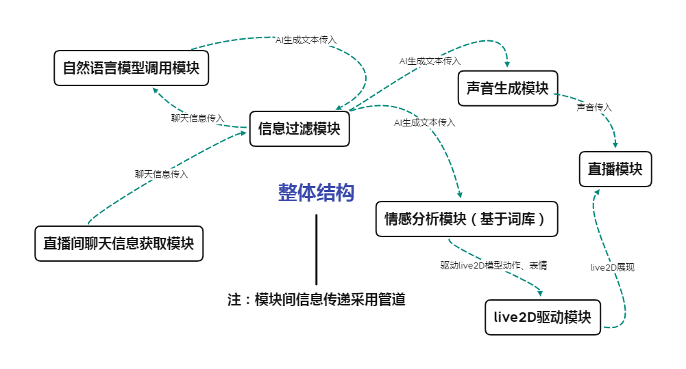

# GoATuber

- 该项目纯属心血来潮。先建个仓库在这里，能不能写完另说了。所以作为自娱自乐的项目，这篇文档也会写得自娱自乐点。项目注释也会。
- AR是VR的升级版，Atuber也该是Vtuber的进化。所以该项目命名为Atuber，不仅仅只代表这是Ai Tuber。至于为什么前缀加个Go，因为笔者目前就会Go和C，写项目就拿Go写了。
- 参考 [cdfmlr/muvtuber ](https://github.com/cdfmlr/muvtuber) 。实际上能有这个项目很大程度上也是因为某个无聊的早上在知乎刷到了这篇文章。
- 此外，关注neuro-sama谢谢喵。

虽然笔者没有一个完善的规划，但是我暂且先把我的看法在这里列一下。

- 1.语言模型将会是这个项目的核心。Vtuber本质是借助live2d和语言对观众传递信息，而“有趣的灵魂”跟语言的关联最大。一个东西叫起来像是鸭子，那它就是鸭子。这背后还会牵涉一堆符号哲学，不展开了。
- 2.围绕语言文字模型展开，我们首先要一个文字转声音的模块。《降临》里有很有意思的一段，女主说人类的文字是二维的，七肢桶是一维的（实际上，是指七肢桶的语音文字和字面文字是分开的）。实际上就是指人类文字是文字符号加声音的叠加。这比单纯的一维的纸面文字传达了更多的信息。
- 3.之后是live2d模型。这一块我完全不懂。但是会参照着 [cdfmlr/muvtuber ](https://github.com/cdfmlr/muvtuber) 所描述的“心情”去做。我个人猜想，本质上是拆词，提取符号，然后映射到对应的动作上去。然后neuro-sama自然状态下的晃动也是应该模拟的，这会让模型显得更加自然。
- 4.然后是读取外界信息，并把信息传给语言模型。这个目前读文本然后传递就行了，如果可以兴许能对接一个语言转文字的服务？
- 5.最后是连接这些东西的技术细节。我的技术栈还是半吊子，甚至半吊子都比不上，有大佬的话欢迎指点。
- 6.模块间的信息传输打算使用grpc。（先起一个头，还要写产品的文案。真找时间的话可能得下周甚至五一才有了）
- 