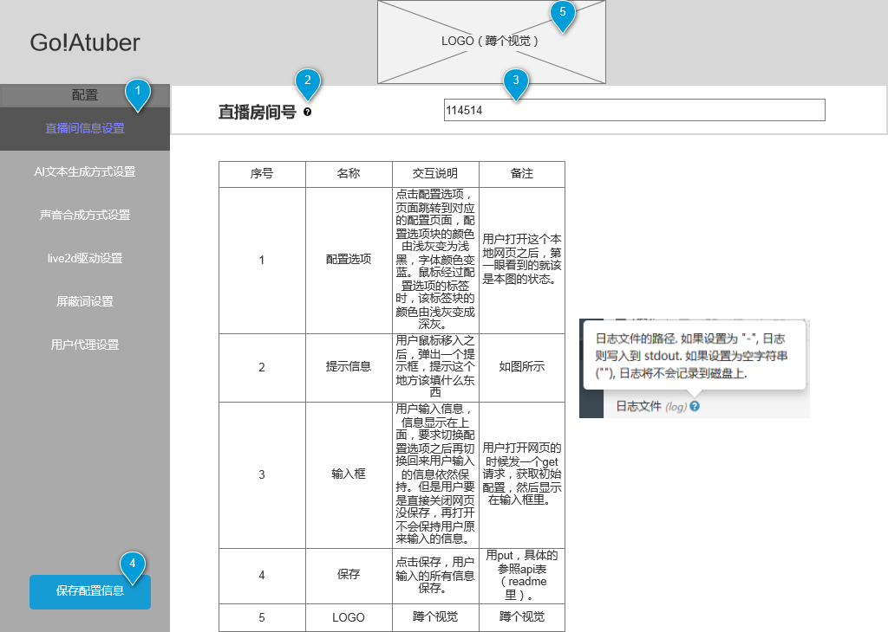

# 前端区
- 包含live2D驱动模块与展示模块，可能包含一个前端的可视化操作界面


## 对接前端可视化界面

- 只是一个实验，蹲一个前端
- 摸索一下先
- 采用gin框架



---

### 功能接口

## 获取config配置信息

请求路径：
```html
GET /configInfo
```
请求参数

| col1 | col2 |     | col3 | |
|------|------|-----|------|-|
|      |      |     |      | |
|      |      |     |      | |

